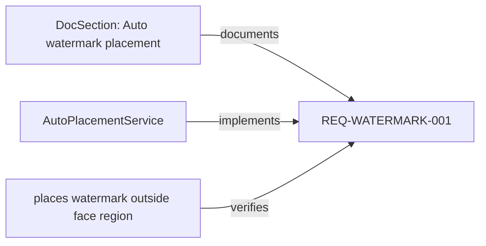

# SpecSlice Web Visualization Design

> **For agentic workers:** REQUIRED SUB-SKILL: Use superpowers:subagent-driven-development (recommended) or superpowers:executing-plans to implement this plan task-by-task. Steps use checkbox (`- [ ]`) syntax for tracking.

**Goal:** Build a browser-viewable, read-only visualization for SpecSlice graphs so users can inspect document facts, code facts, semantic code edges, confirmed business logic links, AI candidates and risks without modifying the target repository.

**Architecture:** The engine exports a stable `GraphViewModel` JSON from `.specslice/graph.db`. The CLI can render that model as JSON, Mermaid, or a self-contained HTML file under `.specslice/export/graph.html`. P6 shipped a deterministic lane layout; P6.1 replaced the default HTML experience with a module tree + SVG graph + detail panel browser so large real repos do not collapse into thousands of flat nodes.

**Tech Stack:** Rust engine/CLI, `serde` data contracts, self-contained HTML/CSS/vanilla JS, optional Mermaid text export.

---

## Design Principles

- **Read-only first:** Visualization must not write `.specslice/links.yaml`, candidates, requirements, code, docs, or tests.
- **No repository intrusion:** Output only goes to `.specslice/export/` unless the user passes `--out`.
- **Offline browser support:** Generated HTML must work without CDN, npm, Vite, React, or a dev server.
- **Facts vs AI vs confirmed:** The UI must visually separate deterministic facts, AI candidates, human-confirmed links, and risk signals.
- **Stable and testable:** Graph JSON is the contract. HTML is a rendering of that contract, not the source of truth.
- **Traceable:** Every node with source location should show `path:start-end`; browser UI should never hide where evidence came from.

## UX Shape

The first screen should be a working graph viewer, not a landing page.

Current layout:

```text
┌────────────────────────────────────────────────────────────────────┐
│ Toolbar: view, search, focus id, layer toggles, candidate/risk       │
├───────────────┬──────────────────────────────────────┬───────────────┤
│ Tree          │ SVG graph canvas                      │ Detail panel  │
│ modules/files │ visible nodes + aggregated edges      │ node/edge data│
└───────────────┴──────────────────────────────────────┴───────────────┘
```

Required interactions:

- Search by label, artifact id, path, or test name.
- Toggle `fact`, `confirmed`, `candidate`, and `risk` layers.
- Click a node to open a right-side detail panel.
- Click an edge to show kind, confidence, status, source, and rationale if present.
- Focus a business logic id, module path, file id, symbol id, test id, or candidate id.
- For module/file/class focus, expand descendants plus their direct graph neighbourhood.
- For method/handler focus, preserve immediate code facts and important semantic context such as provider reads, stream subscriptions, navigation, and persistence.
- Show empty states clearly, especially “No confirmed business logic yet”.

Candidate confirmation UX:

- Candidate nodes must show a concise natural-language business description first; evidence ids are secondary and expandable.
- For Chinese users, the review surface should be able to present Chinese confirmation copy such as “建议确认 / 建议暂缓 / 需要补充问题”.
- The UI should separate four states: AI-proposed candidate, product-owner accepted business logic, rejected candidate, and needs-changes candidate.
- Needs-changes items should show the requested closure action first, for example “补首页项目生命周期测试” or “列出并确认 Pro 付费项目”.
- Accept/reject actions are future interactive workflow; until then, generated HTML remains read-only and should point users to the review decision artifact.
- A candidate with resolvable evidence is not a confirmed business rule. Visual wording must not imply product correctness until a human accepts it.

Visual encoding:

| Type | Shape | Color | Edge Style |
| --- | --- | --- | --- |
| Document / DocSection | rectangle | blue gray | fact edges thin gray |
| BusinessLogic / Requirement | rounded rectangle | green | confirmed edges solid green |
| CodeSymbol | rectangle | violet | implementation edges solid violet |
| TestCase / TestGroup | rectangle | teal | verification edges solid teal |
| Candidate | dashed rectangle | amber | candidate edges dashed amber |
| Risk | warning pill | red/orange | risk edges dotted red |

Avoid a one-color graph. The visual distinction between “known fact”, “AI guess”, and “human-confirmed relationship” is the core product value.

## CLI Contract

Add a new command:

```bash
specslice graph --format html
specslice graph --format json
specslice graph --format mermaid
```

Flags:

```bash
--out <path>              # default .specslice/export/graph.html for html
--focus <id>              # requirement id, module path, artifact id, stable key
--include-candidates      # include .specslice/candidates/business_logic.yaml
--include-risks           # include check/confidence findings, default true
--max-nodes <n>           # default 80 for html, unlimited for json
--open                    # optional later; not required for CI
```

Initial behavior:

- `--format json` prints or writes the `GraphViewModel`.
- `--format html` writes a complete HTML file with embedded JSON and renderer script.
- `--format mermaid` writes a Mermaid `flowchart LR` for quick documentation embedding.
- HTML generation must not require network access or a running server.

## Data Contract

The engine-level view model is independent of SQLite row shape. Current schema version is `2`; schema version `1` below is the historical P6 starting point. New readers must accept the extra P6.1+ fields (`view`, `column`, `parent_id`, `child_count`, `default_visible`, evidence fields, resolver).

```rust
#[derive(Debug, Clone, Serialize, Deserialize, PartialEq)]
pub struct GraphViewModel {
    pub schema_version: u32,
    pub repo_root: String,
    pub generated_at: String,
    pub focus: Option<String>,
    pub stats: GraphStats,
    pub nodes: Vec<GraphNode>,
    pub edges: Vec<GraphEdge>,
    pub findings: Vec<GraphFinding>,
}

#[derive(Debug, Clone, Serialize, Deserialize, PartialEq, Eq)]
pub struct GraphStats {
    pub documents: usize,
    pub business_logic: usize,
    pub code_symbols: usize,
    pub tests: usize,
    pub confirmed_edges: usize,
    pub candidate_edges: usize,
    pub risks: usize,
}

#[derive(Debug, Clone, Serialize, Deserialize, PartialEq)]
pub struct GraphNode {
    pub id: String,
    pub kind: String,
    pub layer: GraphLayer,
    pub label: String,
    pub path: Option<String>,
    pub line_range: Option<(u32, u32)>,
    pub status: GraphStatus,
    pub confidence: Option<f32>,
    pub source: Option<String>,
    pub badges: Vec<String>,
}

#[derive(Debug, Clone, Serialize, Deserialize, PartialEq)]
pub struct GraphEdge {
    pub id: String,
    pub from: String,
    pub to: String,
    pub kind: String,
    pub layer: GraphLayer,
    pub status: GraphStatus,
    pub confidence: Option<f32>,
    pub source: Option<String>,
    pub rationale: Option<String>,
}

#[derive(Debug, Clone, Serialize, Deserialize, PartialEq)]
pub struct GraphFinding {
    pub code: String,
    pub severity: String,
    pub message: String,
    pub target_id: Option<String>,
}

#[derive(Debug, Clone, Copy, Serialize, Deserialize, PartialEq, Eq)]
#[serde(rename_all = "snake_case")]
pub enum GraphLayer {
    Fact,
    Confirmed,
    Candidate,
    Risk,
}

#[derive(Debug, Clone, Copy, Serialize, Deserialize, PartialEq, Eq)]
#[serde(rename_all = "snake_case")]
pub enum GraphStatus {
    Confirmed,
    Proposed,
    Rejected,
    Stale,
    Missing,
    Unknown,
}
```

Mapping rules:

- `NodeKind::DocSection` -> `GraphLayer::Fact`, column `Documents`.
- `NodeKind::Requirement` -> `GraphLayer::Confirmed`, column `Business`.
- Dart classes, methods, functions, constructors -> `GraphLayer::Fact`, column `Code`.
- Dart providers, routes and storage nodes -> `GraphLayer::Fact`, column `Code`.
- Test cases and groups -> `GraphLayer::Fact`, column `Tests`.
- `EdgeCertainty::Fact` -> `GraphLayer::Fact`.
- `EdgeSource::ExternalManifest` + `Confirmed` -> `GraphLayer::Confirmed`.
- `.specslice/candidates/business_logic.yaml` entries -> `GraphLayer::Candidate`.
- Checks and LogicConfidence findings -> `GraphLayer::Risk`.

Important: Do not create business logic nodes from Markdown frontmatter or heading patterns. Business nodes come only from confirmed external graph data or future accepted AI requirement registry entries.

## HTML Rendering Contract

Generated HTML structure:

```html
<!doctype html>
<html lang="en">
  <head>
    <meta charset="utf-8">
    <meta name="viewport" content="width=device-width, initial-scale=1">
    <title>SpecSlice Graph</title>
    <style>/* embedded */</style>
  </head>
  <body>
    <main id="app"></main>
    <script id="specslice-data" type="application/json">{...}</script>
    <script>/* embedded renderer */</script>
  </body>
</html>
```

Renderer responsibilities:

- Parse `#specslice-data`.
- Build the module/file/symbol tree from `parent_id`.
- Render nodes as buttons for keyboard accessibility.
- Render edges in an absolute-positioned SVG overlay after layout.
- Recompute edge paths on resize and filter changes.
- Populate detail panel from selected node/edge.
- Never fetch remote resources.

Current layout algorithm:

1. Split nodes by `parent_id` into a tree.
2. Render only `default_visible` nodes plus user-expanded descendants.
3. When an edge endpoint is hidden, walk up `parent_id` to the nearest visible ancestor and render a deduplicated aggregate edge.
4. Draw cubic bezier edges between visible node centers.
5. Hide edges whose endpoints cannot be represented by a visible node.

This deterministic layout is less flashy than a force graph, but easier to inspect, easier to test, and better suited to large codebases where folder hierarchy matters.

## Mermaid Output

Mermaid is useful for docs and PR comments, but not sufficient as the primary UI. Keep it as a secondary format.

Example:



Mermaid export rules:

- Escape labels.
- Use stable node aliases like `n0`, `n1`, not raw artifact IDs.
- Limit to focused graph when `--focus` is set.
- If graph exceeds `--max-nodes`, include a truncation note.

## Files To Create Or Modify

- Create `crates/specslice-engine/src/graph.rs`
  - Build `GraphViewModel` from `Store`.
  - Apply focus and max-node filtering.
  - Convert checks/risks into `GraphFinding`.
- Modify `crates/specslice-engine/src/lib.rs`
  - Export `build_graph_view`, `GraphOptions`, `GraphViewModel`.
- Create `crates/specslice-cli/src/commands/graph.rs`
  - Print JSON, write HTML, write Mermaid.
- Modify `crates/specslice-cli/src/commands/mod.rs`
  - Add `pub mod graph;`.
- Modify `crates/specslice-cli/src/main.rs`
  - Add `Graph` subcommand and CLI flags.
- Create `crates/specslice-cli/src/commands/graph_html.rs`
  - Self-contained HTML renderer template.
- Create `crates/specslice-cli/src/commands/graph_mermaid.rs`
  - Mermaid serializer.
- Create `crates/specslice-engine/tests/graph.rs`
  - Engine behavior tests.
- Create `crates/specslice-cli/tests/graph.rs`
  - CLI e2e tests.
- Modify `docs/implementation-plan.md`
  - Link to this design from P6.

## Implementation Plan

### Task 1: Engine Graph View Model

**Files:**

- Create: `crates/specslice-engine/src/graph.rs`
- Modify: `crates/specslice-engine/src/lib.rs`
- Test: `crates/specslice-engine/tests/graph.rs`

- [ ] **Step 1: Write the failing engine test**

Create a fixture graph with one doc section, one requirement from `.specslice/links.yaml`, one Dart class, and one test. Assert that `build_graph_view` returns layered nodes and confirmed edges.

Run:

```bash
cargo test -p specslice-engine --test graph graph_view_contains_layered_confirmed_nodes --quiet
```

Expected: fail because `graph` module does not exist.

- [ ] **Step 2: Implement minimal graph model**

Add `GraphViewModel`, `GraphNode`, `GraphEdge`, `GraphLayer`, `GraphStatus`, `GraphOptions`, and `build_graph_view`.

Minimal behavior:

- List nodes from `Store`.
- List edges from `Store`.
- Map node/edge kinds to layers.
- Sort nodes and edges by id.

- [ ] **Step 3: Run the focused test**

```bash
cargo test -p specslice-engine --test graph graph_view_contains_layered_confirmed_nodes --quiet
```

Expected: pass.

- [ ] **Step 4: Commit**

```bash
git add crates/specslice-engine/src/graph.rs crates/specslice-engine/src/lib.rs crates/specslice-engine/tests/graph.rs
git commit -m "增加图谱可视化视图模型"
```

### Task 2: Focus And Limits

**Files:**

- Modify: `crates/specslice-engine/src/graph.rs`
- Test: `crates/specslice-engine/tests/graph.rs`

- [ ] **Step 1: Write the failing focus test**

Add a second unrelated requirement and assert `GraphOptions { focus: Some("REQ-WATERMARK-001") }` returns only the focused requirement, directly connected docs, implementations, tests, and findings.

Run:

```bash
cargo test -p specslice-engine --test graph graph_focus_keeps_only_connected_neighbourhood --quiet
```

Expected: fail because focus is ignored.

- [ ] **Step 2: Implement neighbourhood filtering**

For a focus id:

- Resolve either raw stable key (`REQ-WATERMARK-001`) or full artifact id (`req::REQ-WATERMARK-001`).
- Include the focus node.
- Include one-hop incoming and outgoing neighbours.
- Include edges whose endpoints are included.

- [ ] **Step 3: Add max-node truncation**

When `max_nodes` is set and the graph exceeds the limit:

- Keep focused nodes first.
- Then confirmed business nodes.
- Then directly connected nodes.
- Add a `GraphFinding` with code `graph_truncated`.

- [ ] **Step 4: Run tests**

```bash
cargo test -p specslice-engine --test graph --quiet
```

Expected: pass.

### Task 3: CLI JSON Export

**Files:**

- Create: `crates/specslice-cli/src/commands/graph.rs`
- Modify: `crates/specslice-cli/src/commands/mod.rs`
- Modify: `crates/specslice-cli/src/main.rs`
- Test: `crates/specslice-cli/tests/graph.rs`

- [ ] **Step 1: Write the failing CLI test**

Use the watermark fixture, run `specslice init`, `specslice index`, then:

```bash
specslice graph --format json
```

Assert stdout is valid JSON and contains `schema_version`, `nodes`, and `edges`.

Run:

```bash
cargo test -p specslice-cli --test graph graph_json_prints_view_model --quiet
```

Expected: fail because command does not exist.

- [ ] **Step 2: Add CLI command**

Add:

```rust
Graph(GraphArgs)
```

with:

```rust
#[derive(Parser, Debug)]
pub struct GraphArgs {
    #[arg(long, default_value = "html")]
    pub format: GraphFormat,
    #[arg(long)]
    pub out: Option<PathBuf>,
    #[arg(long)]
    pub focus: Option<String>,
    #[arg(long, default_value_t = true)]
    pub include_risks: bool,
    #[arg(long)]
    pub include_candidates: bool,
    #[arg(long)]
    pub max_nodes: Option<usize>,
}
```

- [ ] **Step 3: Run CLI JSON test**

```bash
cargo test -p specslice-cli --test graph graph_json_prints_view_model --quiet
```

Expected: pass.

### Task 4: Self-Contained HTML Export

**Files:**

- Create: `crates/specslice-cli/src/commands/graph_html.rs`
- Modify: `crates/specslice-cli/src/commands/graph.rs`
- Test: `crates/specslice-cli/tests/graph.rs`

- [ ] **Step 1: Write the failing HTML test**

Run:

```bash
specslice graph --format html
```

Assert `.specslice/export/graph.html` exists and contains:

- `<script id="specslice-data" type="application/json">`
- `SpecSlice Graph`
- no `https://`
- no `http://`

- [ ] **Step 2: Implement HTML renderer**

The renderer should include:

- embedded CSS,
- embedded JSON,
- embedded JS,
- toolbar,
- lane containers,
- SVG edge layer,
- details panel.

Do not add npm, Vite, React, or external JS dependencies.

- [ ] **Step 3: Run HTML test**

```bash
cargo test -p specslice-cli --test graph graph_html_writes_self_contained_file --quiet
```

Expected: pass.

### Task 5: Mermaid Export

**Files:**

- Create: `crates/specslice-cli/src/commands/graph_mermaid.rs`
- Modify: `crates/specslice-cli/src/commands/graph.rs`
- Test: `crates/specslice-cli/tests/graph.rs`

- [ ] **Step 1: Write the failing Mermaid test**

Run:

```bash
specslice graph --format mermaid
```

Assert stdout starts with `flowchart LR` and includes at least one edge label.

- [ ] **Step 2: Implement Mermaid serializer**

Serialize visible nodes and edges from `GraphViewModel`.

Rules:

- Aliases: `n0`, `n1`, ...
- Escape `"` as `\"`.
- Edge label is `edge.kind`.

- [ ] **Step 3: Run Mermaid test**

```bash
cargo test -p specslice-cli --test graph graph_mermaid_prints_flowchart --quiet
```

Expected: pass.

### Task 6: Risk And Candidate Overlay

**Files:**

- Modify: `crates/specslice-engine/src/graph.rs`
- Modify: `crates/specslice-cli/src/commands/graph_html.rs`
- Test: `crates/specslice-engine/tests/graph.rs`
- Test: `crates/specslice-cli/tests/graph.rs`

- [ ] **Step 1: Add risk findings test**

Create a graph with a requirement linked to implementation but no linked test. Assert `include_risks` adds a `missing_linked_test` finding and a risk node or detail-panel finding.

- [ ] **Step 2: Implement risk mapping**

Call existing checks from graph build, or accept check findings as input if avoiding recursion is cleaner.

- [ ] **Step 3: Add candidate placeholder test**

Until `.specslice/candidates/` is implemented, `--include-candidates` should not fail. It should return zero candidate edges and a stable empty state.

- [ ] **Step 4: Run related tests**

```bash
cargo test -p specslice-engine --test graph --quiet
cargo test -p specslice-cli --test graph --quiet
```

Expected: pass.

### Task 7: Final Gates

**Files:**

- Modify: `docs/implementation-plan.md`
- Keep: `docs/visualization-design.md`

- [ ] **Step 1: Run formatting**

```bash
cargo fmt --all -- --check
```

Expected: pass.

- [ ] **Step 2: Run clippy**

```bash
cargo clippy --workspace --all-targets -- -D warnings
```

Expected: pass.

- [ ] **Step 3: Run all tests**

```bash
cargo test --workspace --quiet
```

Expected: pass.

- [ ] **Step 4: Run diff whitespace check**

```bash
git diff --check
```

Expected: pass.

- [ ] **Step 5: Commit**

```bash
git add crates/specslice-engine/src/graph.rs crates/specslice-cli/src/commands/graph.rs crates/specslice-cli/src/commands/graph_html.rs crates/specslice-cli/src/commands/graph_mermaid.rs crates/specslice-engine/tests/graph.rs crates/specslice-cli/tests/graph.rs crates/specslice-engine/src/lib.rs crates/specslice-cli/src/main.rs crates/specslice-cli/src/commands/mod.rs docs/implementation-plan.md docs/visualization-design.md
git commit -m "增加可视化图谱导出"
```

## Acceptance Criteria

- `specslice graph --format json` outputs valid JSON.
- `specslice graph --format html` writes `.specslice/export/graph.html`.
- Opening the HTML file in a browser shows a graph viewer without a dev server.
- The HTML has no remote network dependency.
- Confirmed edges and fact edges are visually distinct.
- Empty confirmed graph state is clear when no business logic has been accepted yet.
- Focus mode works for `REQ-*` stable keys and full artifact ids.
- Mermaid export works for small focused graphs.
- All gates pass:

```bash
cargo fmt --all -- --check
cargo clippy --workspace --all-targets -- -D warnings
cargo test --workspace --quiet
git diff --check
```

## Future Extensions

- `specslice graph serve` for auto-refresh during local exploration.
- Interactive candidate accept/reject UI after candidate storage is stable.
- Diff overlay for `specslice impact --base <ref> --graph`.
- File opener integration through configurable `link_mode = "none" | "file" | "vscode"`.
- Export PNG/SVG after HTML renderer is stable.
